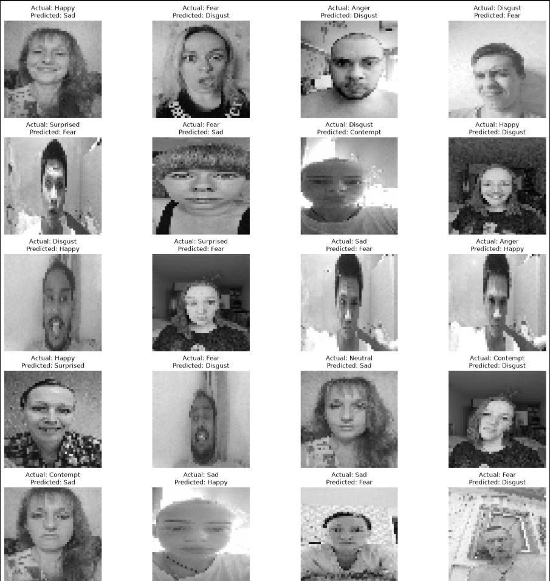

# Real-Time Facial Emotion Recognition

## Overview
This project is a Convolutional Neural Network (CNN)-based facial emotion recognition system. It classifies facial expressions into eight emotion categories using grayscale facial images.

## Features
- Image preprocessing using OpenCV
- CNN model built with TensorFlow/Keras
- Emotion classification into 8 categories
- Model evaluation with prediction visualization
- Implemented in Jupyter Notebook

## Technologies Used
- Python 3.11
- TensorFlow
- Keras
- OpenCV
- NumPy
- Pandas
- Matplotlib
- Scikit-learn

## Dataset
The dataset contains images of facial expressions for:
- Anger
- Contempt
- Disgust
- Fear
- Happy
- Neutral
- Sad
- Surprised

> Note: The dataset is not included in this repository because of its size.

## Project Structure
```
Emotion-Detection-System/
│
├── facial emotions.ipynb
├── README.md
├── requirements.txt
└── .gitignore
```

## Sample Output

The CNN model predicts facial emotions from input images.



## Author
Charan Vivek